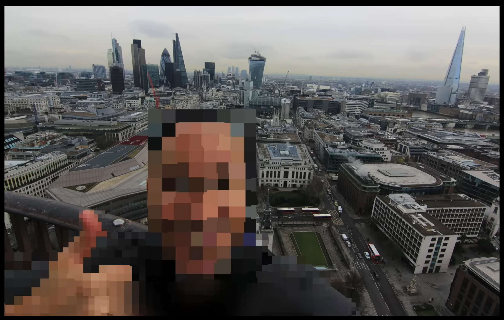
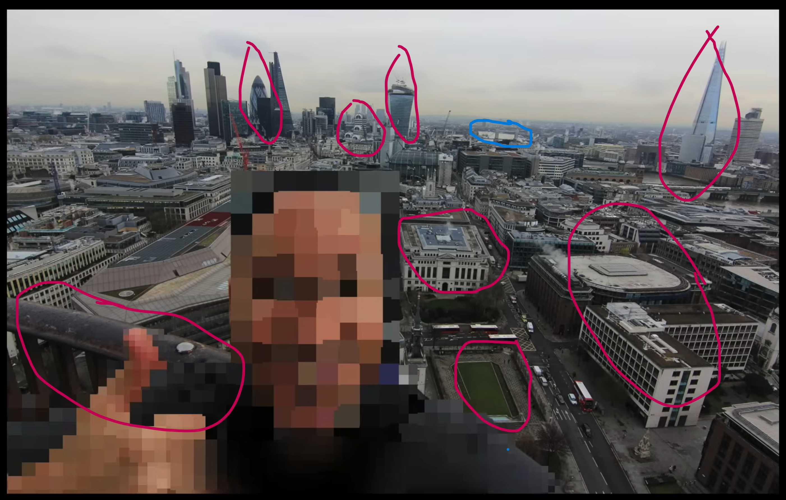
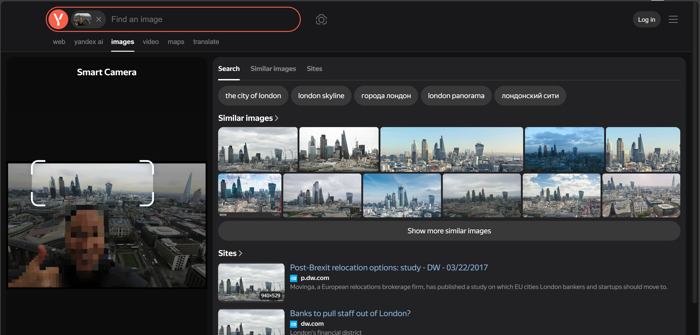
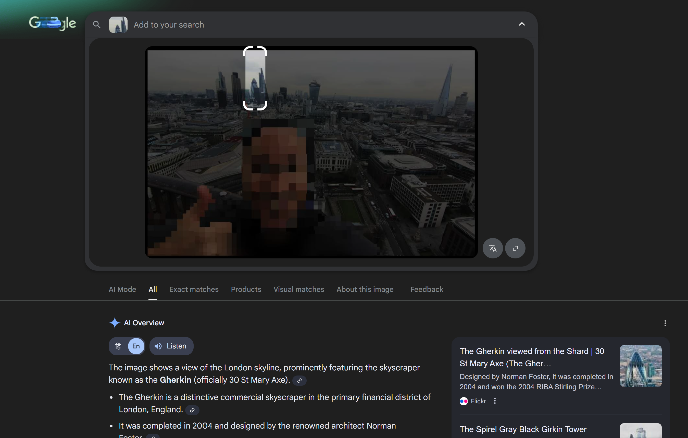

## 📌 Case Objective
The objective of this investigation was to determine the **geographical location of an image** using **Image OSINT techniques**, without relying on metadata (EXIF).

The analysis was performed using **visual clues, reverse image search, and Google Earth**.

---

## 🖼 Image Information
- **Source:** Publicly available image  
- **Metadata:** ❌ Not available  
- **Faces / Sensitive details:** Blurred for privacy  
- **Purpose:** Educational & skill-building  

📷 Reference Image:

---

## 🛠 Tools Used
- Google Reverse Image Search  
- Google Earth  
- Manual visual analysis  
- Screenshot & annotation tools  

---

## 🔍 Investigation Methodology

### Step 1: Initial Visual Analysis
The investigation began with careful visual observation of the image.

The following elements were identified:
- Presence of **iconic and large buildings**, indicating a **big or well-developed city**
- A **garden-like area** was visible near the location where the person was standing
- A **lake or water body** was observed in the right corner when zooming into the image
- The person appeared to be standing at a **height**, likely on a building
- The building featured a **balcony with a rounded railing**, suggesting a **circular or semi-circular structure**

These observations helped form an initial understanding of the environment.

### Step 2: Reverse Image Search & Landmark Identification

To gain additional context, a **reverse image search** was performed using **Yandex Image Search**.

The image background was uploaded to Yandex, which returned multiple visually similar results containing **iconic buildings and skyline views**. Many of these results were associated with the **London Skyline**, indicating that the image was likely taken in **London**.

*Figure: Yandex reverse image search results showing similar images linked to the London skyline.*

---

#### Iconic Building Analysis
Among the returned results, one **distinctive and iconic building** stood out repeatedly. This building had a **unique curved and cylindrical shape**, which made it easily recognizable.

Further independent research on this building revealed that it is:

**30 St Mary Axe (The Gherkin)**  
- A **591 ft (180 m)** tall skyscraper  
- Located in the **City of London**  
- Known for its **distinctive modern architecture**

Identifying this landmark confirmed that the image background belonged to the **London metropolitan area**, further strengthening the accuracy of the investigation.

This information significantly narrowed the search area and allowed the investigation to proceed with **Google Earth** for precise geolocation.

